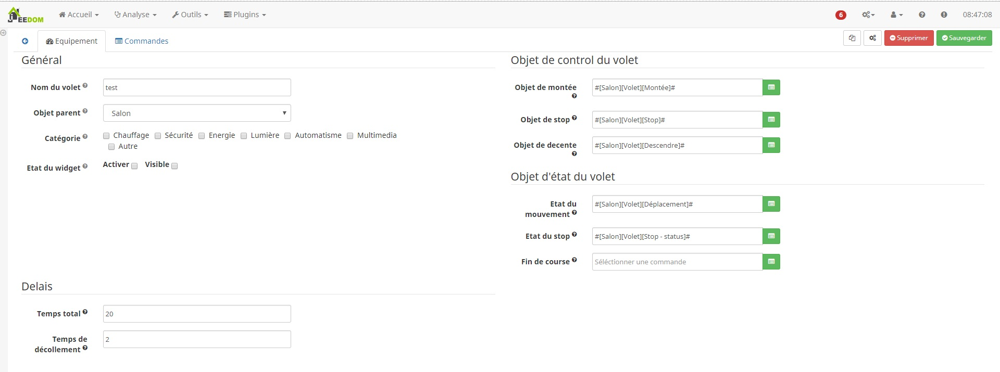

Description
===
Ce plugin a pour but de permetre de gerer ses volets de maniere proportionnel

Paramétrage d'un volet proportionnel
===

La page de configuration est assez simple.

Géneral
---

* Nom du volet : Le nom a déjà été paramétrée mais vous avez la possibilité de la changer
* Objet parent : Ce paramétré permet d'ajouter l'équipement dans un objet Jeedom
* Catégorie : Déclare l'équipement dans une catégorie
* Visible : Permet de rendre l'équipement visible dans le Dashboard
* Activer : Permet d'activer l'équipement

Objet de control du volet
---

* Objet de montée : Commande jeedom permétant de controler la montée (Action -> Defaut)
* Objet de stop  : Commande jeedom permétant de controler le stop (Action -> Defaut)
* Objet de decente : Commande jeedom permétant de controler la déscente (Action -> Defaut)

Objet d'état du volet
---

* Etat du mouvement  : Commande jeedom representant l'etat du mouvement(info -> Binaire : 0 = déscente, 1 = montée)
* Etat du stop  :  Commande jeedom representant l'etat du stop(info -> Binaire : 1 = stop)
* Fin de course  :  Commande jeedom representant la fin de course(info -> Binaire :1 = Volet commpletement fermé)

Délais
---

* Temps total descente : Temps total que met le volet pour une fermeture
* Temps total montée : Temps total que met le volet pour une ouverture
* Temps de décollement : Temps avant lequel le volet se decolle du sol
